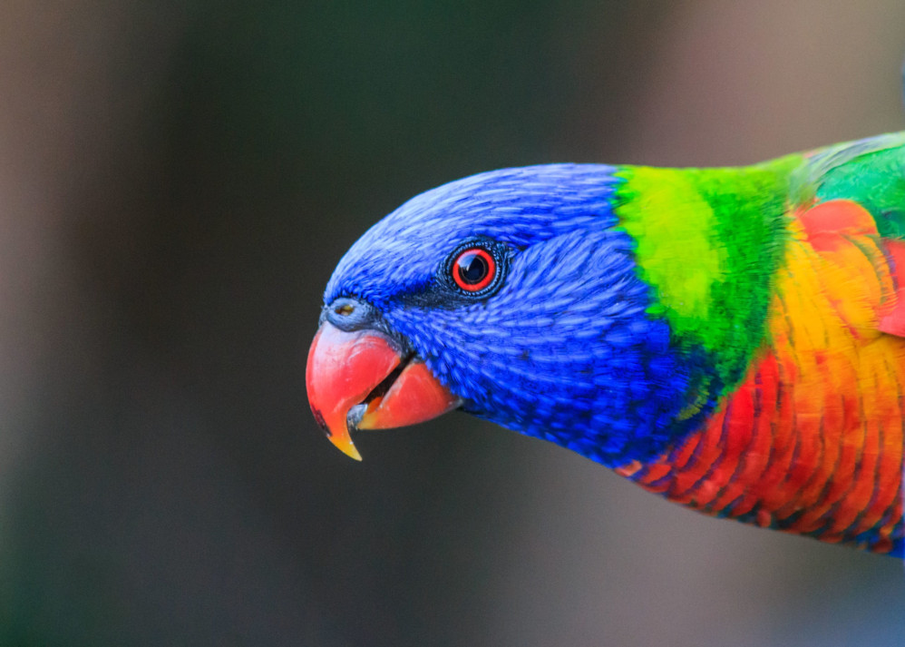
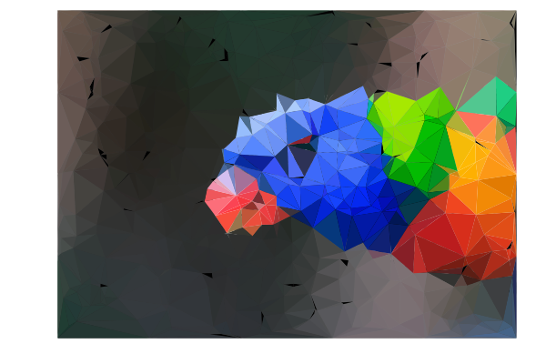
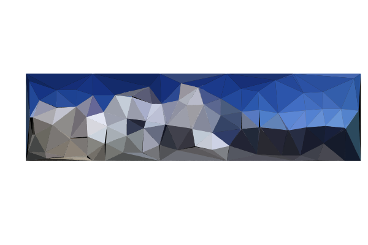
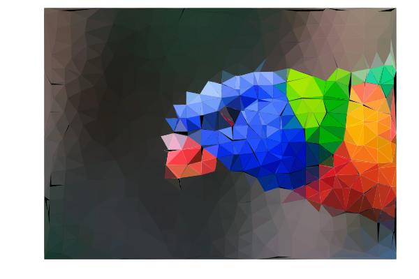
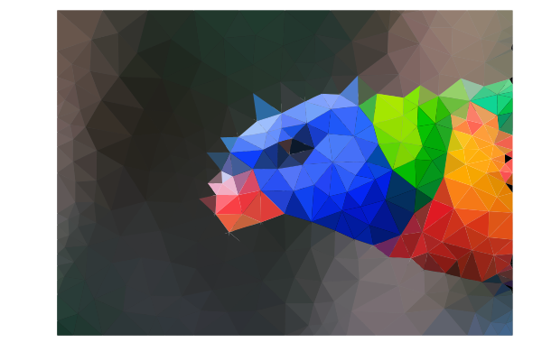
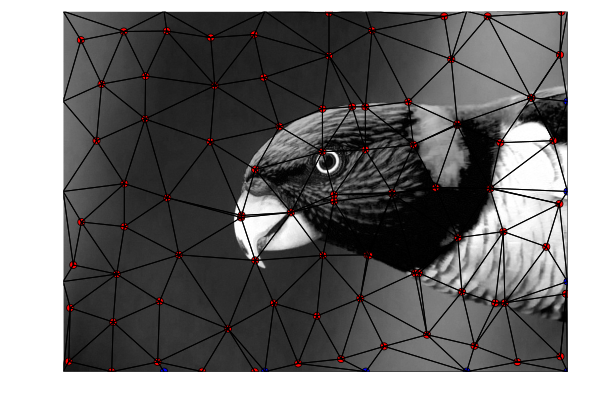
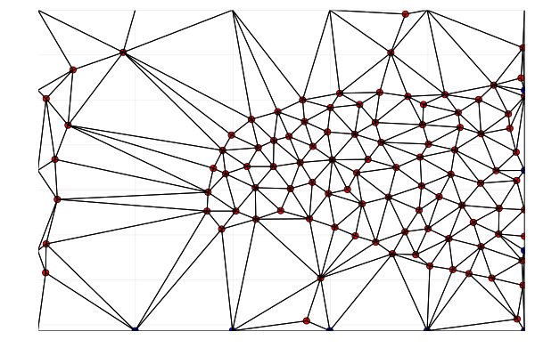

# TriangulArt

[](https://github.com/jonocarroll/TriangulArt.jl/actions/workflows/CI.yml?query=branch%3Amain)

Transform an image into to a low-resolution artistic version using Delaunay Triangulation.

This package is a learning exercise for me. YMMV. Some behind-the-scenes details are in [this blog post](https://jcarroll.com.au/2024/02/04/my-first-julia-package-triangulart-jl/).

This began life as a Julia port of 
[this Python-based script](https://www.degeneratestate.org/posts/2017/May/24/images-to-triangles/) 
by Iain Barr, but will likely diverge as time goes on.

## Installation

```
julia> Pkg.add("https://github.com/jonocarroll/TriangulArt.jl")
```

### Usage

To use this package, `load` an image then call `triangulArt()` on it

```
using FileIO
using TriangulArt

bird = load("examples/bird_small.jpg")
```



A "fast" version samples entirely randomly,and likely produces poor results

```
triangulArt(bird, npts=500, fast=true)
```



Instead, using entropy-based sampling is slower, but produces better results 
with fewer points (default 100)

```
triangulArt(bird)
```


```
everest = load("examples/everest.jpeg")
```


```
triangulArt(everest)
```



A small number of named options are available, including:

* `npts=100`: change the number of points to be sampled from the entropy
* `fast=false`: use a "fast" algorithm selecting points randomly, or a "slow" 
entropy-based algorithm
* `refine=false`: use the `DelaunayTriangulation` `refine` method to add more 
triangles where possible
* `debug=false`: draw the sampled points and edges explicitly
* `showimage=true`: show a grayscale version of the original image beneath the 
debug points
* `showimagecol=true`: show a colour version of the original image beneath the 
debug points

```
triangulArt(bird, npts=500)
```



```
triangulArt(bird, npts=100, refine=true)
```



```
triangulArt(bird, npts=100, debug=true)
```



```
triangulArt(bird, npts=100, debug=true, showimage=false)
```



## Method

Following the [the original script described here](https://www.degeneratestate.org/posts/2017/May/24/images-to-triangles/), 
this package first generates points spaced evenly around the border.

Rather than randomly selecting points around the image, especially where there are 
large blocks of a single colour, points should be selected where large changes occur, 
e.g. from one colour to the another (an edge). I did attempt to solve this with an 
edge-detection algorithm, but even better is to use the local entropy of the image, 
determined as the number of bits required to encode the histogram of the grayscale 
pixes in that region.

The entropy of each point is calculated using a disk of 20px - this currently uses 
`skimage` directly from python as the closest Julia implementation I could find uses a 
square `ImageFiltering::mapwindow()`. Otherwise, a close equivalent would be

```
function shannon(w::AbstractMatrix)
    cm = collect(values(countmap(w))) / sum(size(w)) / 256
    sum([-x * log2(x) for x in cm])
end

# window dimensions must be odd
mapwindow(shannon, im1, (19, 19))
```

The point with the highest entropy is selected, then a Gaussian centered on 
this point is subtracted from the entropy, reducing the neighbouring points 
(so that the sampled points are not too close together).

These two steps - calculating the entropy and finding the point with the 
maximum entropy (currently via `findmax()`) are the two largest bottlenecks 
to performance.

Once `npts` are selected, a `DelaunayTriangulation::triangulate()` is performed 
on the combined edge points and maximum-entropy points. If requested, this is 
`DelaunayTriangulation::refine()`d.

The triangle to which each pixel belongs is calculated, then the average colour 
of each triangle is determined. The triangles are then drawn and filled with the 
respective average colour.

The source for the python version is [forked here](https://github.com/jonocarroll/images-to-triangles) where I have made minor tweaks to bring it back up to date with current package versions.

## Limitations / Known Issues

* The white border around the produced image remains - I have tried setting 
`margin=0mm` but that doesn't appear to help

* Performance is not as good as it can be, I suspect; the entropy calculation 
(calling python) is definitely a bottleneck. Profiling also suggests the `findmax()`
is expensive.

* To speed up the processing, only every 10th pixel is used to determine the 
average colour of the triangle - this may fail to identify an entire triangle.

* CI - I generated this package in VSCode using `PkgTemplates` and it is the 
first Julia package I've built. CI failed immediately, so I've probably done 
something wrong.

* I am still somewhat of a beginner in Julia, so there are probably many places 
in which improvements can be made - feel free to suggest them!

